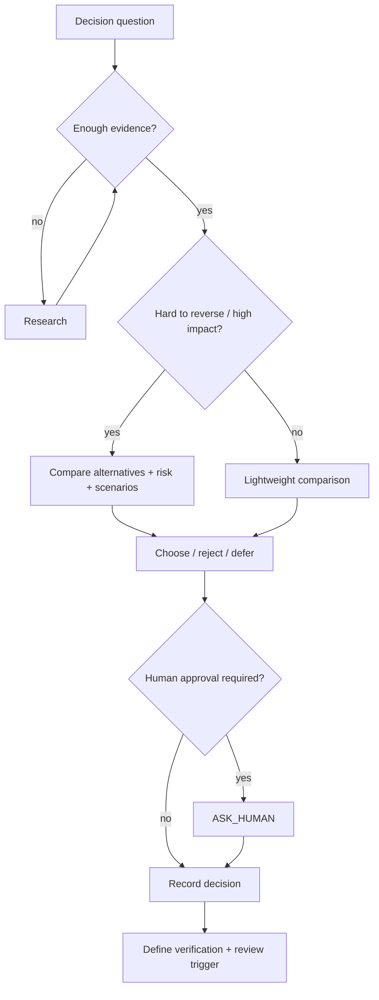

# Decision Engine

A decision is a governed transition from uncertainty to an authorized choice. It records why the choice is reasonable and what would make it worth revisiting.

## Decision anatomy

1. question
2. context
3. options
4. constraints
5. assumptions
6. evidence
7. risks
8. cost / complexity
9. reversibility
10. consequences
11. chosen option
12. rejected alternatives and why
13. verification required
14. reconsideration trigger

## Flow

## Decision classes

- architecture → ADR
- product/scope → DECISION
- risk acceptance → risk record + decision
- doctrine override → override record
- tactical reversible choice → quick decision if recording is useful

## Related

- [[decision-engine/DECISION_INDEX]]
- [[decision-engine/REVERSIBILITY_ANALYSIS]]
- [[decision-engine/WHAT_IF_ENGINE]]
- [[decision-engine/CONTRADICTION_ENGINE]]
- [[cognitive-os/06_CERTAINTY_AND_EVIDENCE]]
- [[templates-v2/DECISION_FULL]]

## Graph neighborhood

- [[cognitive-os/hubs/DECISION_GOVERNANCE_SECTOR]]
- [[decision-engine/CONTRADICTION_ENGINE]]
- [[decision-engine/DECISION_INDEX]]
- [[decision-engine/DECISION_TREE_SPEC]]
- [[decision-engine/REVERSIBILITY_ANALYSIS]]
- [[decision-engine/trees/FEATURE_INTAKE_TREE]]
- [[decision-engine/WHAT_IF_ENGINE]]
- [[cognitive-os/06_CERTAINTY_AND_EVIDENCE]]
- [[cognitive-os/07_LIFECYCLE_AND_STATE]]
- [[cognitive-os/09_OVERRIDE_PROTOCOL]]
- [[cognitive-os/QUERY_ROUTER]]
- [[mesh/governance/Change Trigger]]
- [[mesh/governance/Cost of Complexity]]
- [[mesh/governance/Drift Detection]]
- [[mesh/governance/Evidence Threshold]]
- [[mesh/governance/Human Approval Gate]]
- [[mesh/governance/Non Goal]]
- [[mesh/governance/Risk Acceptance]]
- [[mesh/governance/Scope Boundary]]
