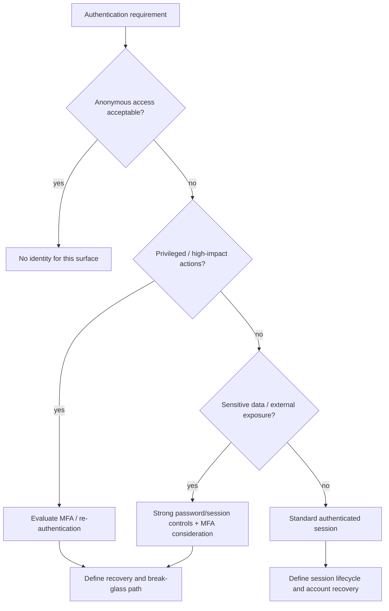

# Authentication Strength Tree

Identity proof does not equal authorization. See Authorization Boundary.

Related: SECURITY_PLANNING_HUB · [[atlas/concepts/AUTHENTICATION]] · [[atlas/concepts/PRIVILEGED_MFA]]

## Graph neighborhood

- [[cognitive-os/hubs/DECISION_GOVERNANCE_SECTOR]]
- [[decision-engine/DECISION_INDEX]]
