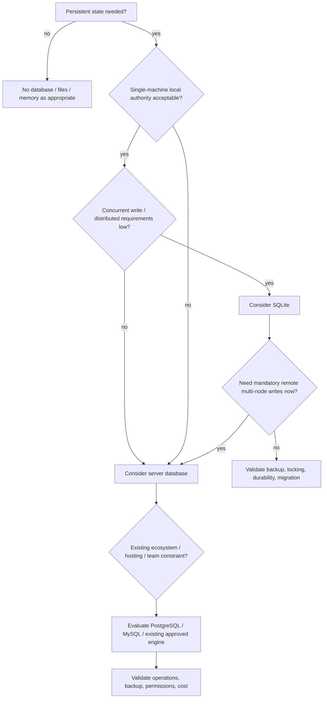

# Database Selection Tree

> [!note]
> This tree narrows questions; it does not substitute for workload evidence or project constraints.

## Decision dimensions

- authority placement
- concurrency
- deployment topology
- operational skill/cost
- backup/restore
- migration
- offline requirements
- ecosystem compatibility

Related: DATA_PLANNING_HUB · [[atlas/concepts/DATABASE_AUTHORITY]] · 08_ANTI_BUREAUCRACY

## Graph neighborhood

- [[cognitive-os/hubs/DECISION_GOVERNANCE_SECTOR]]
- [[decision-engine/DECISION_INDEX]]
