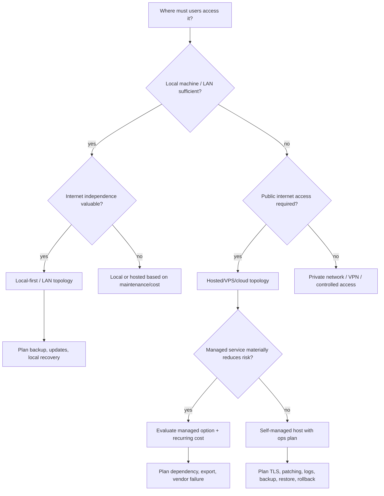

# Deployment Architecture Tree

Related: PLATFORM_OPERATIONS_PLANNING_HUB · Deployment Topology · RISK_SYSTEM

## Graph neighborhood

- [[cognitive-os/hubs/DECISION_GOVERNANCE_SECTOR]]
- [[decision-engine/DECISION_INDEX]]
