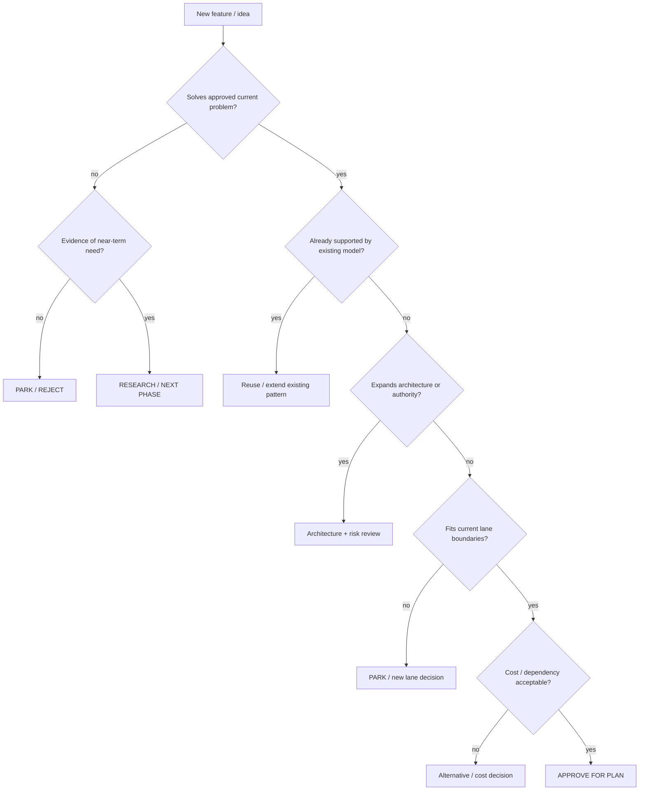

# Feature Intake Tree

## Terminal states

`CURRENT_PHASE`, `NEXT_PHASE`, `PARKED`, `REJECTED`, `NEEDS_RESEARCH`, `NEEDS_DECISION`.

Related: [[project-factory/02_FEATURE_STACKING_GUARD]] · [[project-factory/09_SCOPE_PARKING_PROTOCOL]] · [[decision-engine/DECISION_ENGINE]]

## Graph neighborhood

- [[cognitive-os/hubs/DECISION_GOVERNANCE_SECTOR]]
- [[decision-engine/DECISION_ENGINE]]
- [[decision-engine/DECISION_INDEX]]
