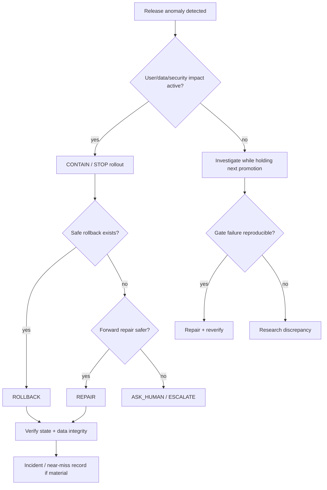

# Release Response Tree

Related: RELEASE_GATE_MODEL · INCIDENT_SYSTEM · SCENARIO_SYSTEM

## Graph neighborhood

- [[cognitive-os/hubs/DECISION_GOVERNANCE_SECTOR]]
- [[decision-engine/DECISION_INDEX]]
