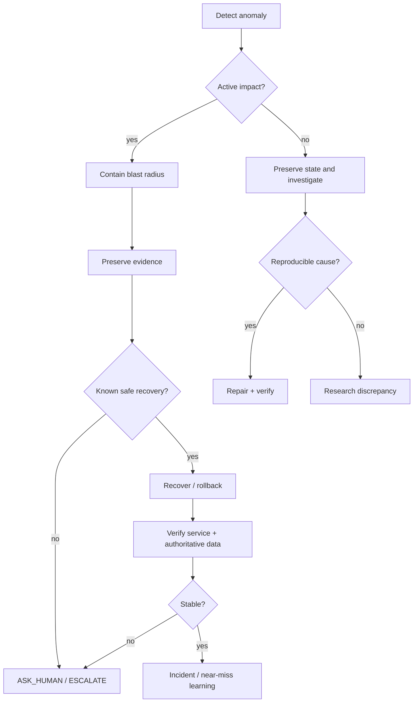

# Failure Response Model

Use this when failure is occurring or strongly suspected.

## Priority order

1. prevent additional harm
2. preserve evidence needed to understand state
3. restore safe authority/integrity
4. verify recovery
5. only then optimize or clean up

## Stop conditions

Escalate rather than improvise when:
- recovery can destroy authoritative data
- scope/authority is unclear
- security compromise may still be active
- rollback and forward repair are both uncertain
- evidence indicates multiple conflicting failure models

Related: [[incident/INCIDENT_SYSTEM]] · [[assurance/RECOVERY_PROOF]] · RELEASE_RESPONSE_TREE

## Graph neighborhood

- [[cognitive-os/hubs/ASSURANCE_LEARNING_SECTOR]]
- [[assurance/RECOVERY_PROOF]]
- [[incident/INCIDENT_SYSTEM]]
